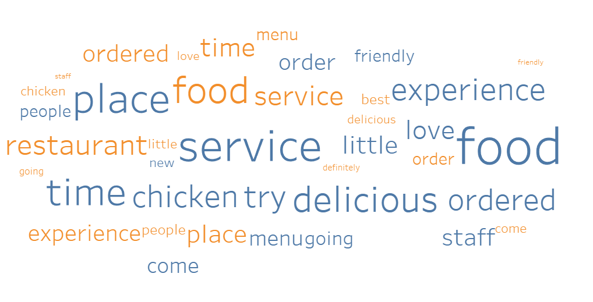

 

 
  <h3 align="center">Yelp_Sentiment_Analisis
</h3>

  

    Web application to identify ikea store furniture in pictures
  

<!-- ABOUT THE PROJECT -->
### About The Project

The data science project completed as part of a Business Software course at HTW Berlin. 

The subject of this data science project is to analyze customer reviews of commercial enterprises posted on Yelp. It also investigated the possibility of predicting customer sentiment based on their reviews. The research allows making strategic decisions in the operation of enterprises.

The study is based on Yelp's extensive database: https://www.kaggle.com/yelp-dataset/yelp-dataset

### Tabelau preview

 
 

### Package contents

- Yelp Reviews Sentimental Analysis.pptx - power point presentation
- Yelp_Analysis.py - python script
- Tableau_Reviews_Text.tbwx - Tableau workbook 
- kaggle.json- access token for kaggle server
- library.py - python script with support functions

### How to use

TO RUN THE PYTHON SCRIPT PLEASE FOLLOW THE INSTRUCTIONS:

1. Download the datasets: yelp_academic_dataset_business and yelp_academic_dataset_review from the kaggle server to the folder where the program is located. 
You can find them at the following address: https://www.kaggle.com/yelp-dataset/yelp-dataset

2. Optionally it is possible to download the datasets aurtomatically by the program. To do this, install the kaggle package ("pip install kaggle") and remove the # sign under point 0 in the script.

3. Install all necessary packages according to the import list. 

4. Now run the python script which should generate two files: Table_Merged.xlsx and Table_splitted.csv

TO RUN THE TABELAU WORKBOOKS PLEASE FOLLOW THE INSTRUCTIONS:

1. Open the packed file Tableau_Reviews_Text.tbwx - Opening datasets can take more than 5 minutes depending on the power of the computer

2. If you prefer to use a table generated by python script open unpacked Tableau_Reviews_Text.tbw from optional folder

3. Add Table_splitted.csv file to data sources 

4. Select all columns with name containing 'text' and select pivot option

5. Replace any missing references with ones from the new table

### Built With

* [Google Colab](https://colab.research.google.com/)
* [Python](https://www.python.org/)
* [PyTorch](https://pytorch.org/)
* [Tabelau](https://www.tableau.com/)

<!-- CONTACT -->
### Contact

Gregor Pawlak - [linkedIn](https://www.linkedin.com/in/grzegorz-pawlak/) 

Project Link: [https://github.com/Greqorian/Yelp_Sentiment_Analisis](https://github.com/Greqorian/Yelp_Sentiment_Analisis)
